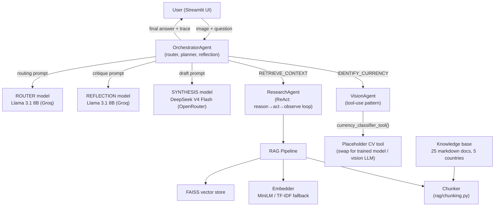

# Architecture Diagram

```mermaid
flowchart TD
    U["User (Streamlit UI)"] -->|"image + question"| O["OrchestratorAgent<br/>(router, planner, reflection)"]

    O -->|"IDENTIFY_CURRENCY"| V["VisionAgent<br/>(tool-use pattern)"]
    V -->|"currency_classifier_tool()"| T["Placeholder CV tool<br/>(swap for trained model / vision LLM)"]

    O -->|"RETRIEVE_CONTEXT"| R["ResearchAgent<br/>(ReAct: reason→act→observe loop)"]
    R --> RAG["RAG Pipeline"]
    RAG --> C["Chunker<br/>(rag/chunking.py)"]
    RAG --> E["Embedder<br/>MiniLM / TF-IDF fallback"]
    RAG --> FAISS["FAISS vector store"]
    KB["Knowledge base<br/>25 markdown docs, 5 countries"] --> C

    O -->|"draft prompt"| S["SYNTHESIS model<br/>DeepSeek V4 Flash (OpenRouter)"]
    O -->|"critique prompt"| RF["REFLECTION model<br/>Llama 3.1 8B (Groq)"]
    O -->|"routing prompt"| RT["ROUTER model<br/>Llama 3.1 8B (Groq)"]

    O -->|"final answer + trace"| U
```
