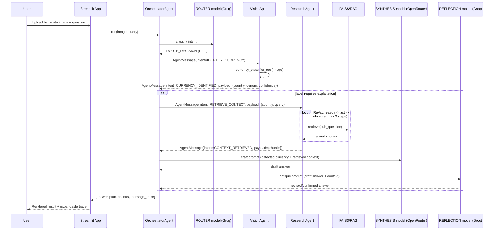

# Agent-to-Agent Message Flow (Sequence Diagram)

```mermaid
sequenceDiagram
    participant User
    participant App as Streamlit App
    participant Orch as OrchestratorAgent
    participant Router as ROUTER model (Groq)
    participant Vis as VisionAgent
    participant Res as ResearchAgent
    participant RAG as FAISS/RAG
    participant Syn as SYNTHESIS model (OpenRouter)
    participant Ref as REFLECTION model (Groq)

    User->>App: Upload banknote image + question
    App->>Orch: run(image, query)

    Orch->>Router: classify intent
    Router-->>Orch: ROUTE_DECISION (label)

    Orch->>Vis: AgentMessage(intent=IDENTIFY_CURRENCY)
    Vis->>Vis: currency_classifier_tool(image)
    Vis-->>Orch: AgentMessage(intent=CURRENCY_IDENTIFIED, payload={country, denom, confidence})

    alt label requires explanation
        Orch->>Res: AgentMessage(intent=RETRIEVE_CONTEXT, payload={country, query})
        loop ReAct: reason -> act -> observe (max 3 steps)
            Res->>RAG: retrieve(sub_question)
            RAG-->>Res: ranked chunks
        end
        Res-->>Orch: AgentMessage(intent=CONTEXT_RETRIEVED, payload={chunks})

        Orch->>Syn: draft prompt (detected currency + retrieved context)
        Syn-->>Orch: draft answer

        Orch->>Ref: critique prompt (draft answer + context)
        Ref-->>Orch: revised/confirmed answer
    end

    Orch-->>App: {answer, plan, chunks, message_trace}
    App-->>User: Rendered result + expandable trace
```
